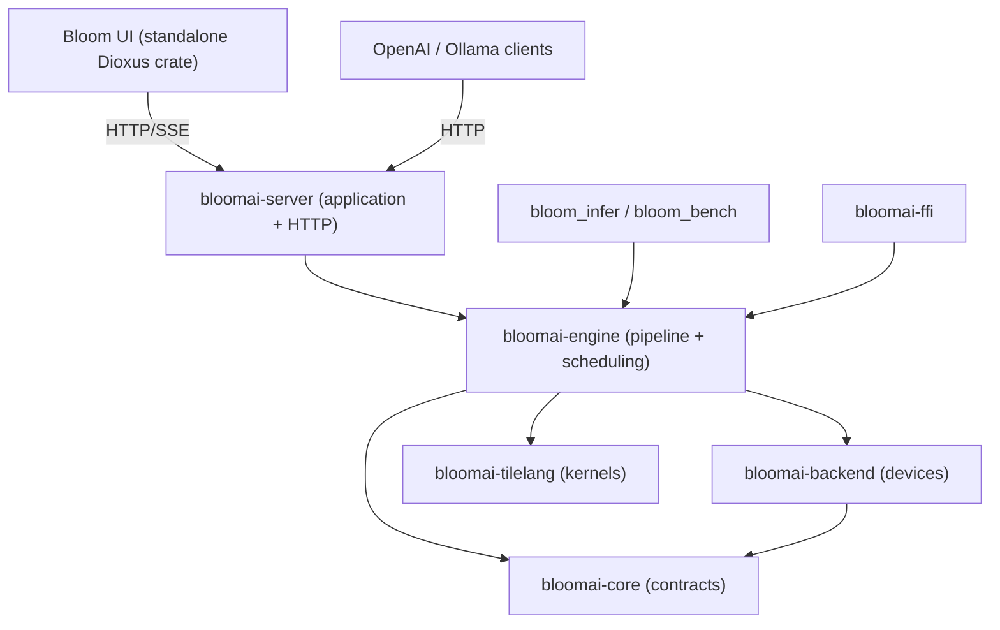

# Architecture

Bloom is a standalone inference engine. It owns model loading, preprocessing,
execution, in-engine scheduling, KV-cache management, and streaming output.
Cross-model orchestration belongs outside the engine.

## Layering and dependency direction

The native workspace follows one-way dependencies. Transport and presentation
may depend on the application and engine layers; the engine never depends on
HTTP or UI code.



`bloomai-server` is the composition root: it owns process configuration,
runtime lifecycle, model catalog services, protocol adapters, routing, and
middleware. The Dioxus UI consumes only versioned HTTP contracts. It can be
hosted independently, or its static build can be embedded in the server by the
`serve-ui` feature. This keeps browser dependencies outside every inference
path.

## Request flow

1. A request enters through `bloom_infer`, the server protocol adapters, or an SDK.
2. `bloomai-server` normalizes HTTP requests and delegates typed work to the engine.
3. `InferencePipeline` loads or infers the model manifest and validates input.
4. `EngineRegistry` selects an engine from declared capabilities instead of
   trying implementations until one works.
5. Memory and security checks run before model execution.
6. The engine scheduler admits prefill and decode work, allocates KV-cache
   blocks, and applies the configured long-context policy.
7. The selected executor runs on a native backend or an explicit external
   runtime and returns typed output chunks.

## Workspace boundaries

| Crate | Responsibility |
| --- | --- |
| `bloomai-core` | Public data types, manifests, resource contracts, scheduling configuration, and errors |
| `bloomai-backend` | Device capabilities, hardware probing, reservation, and backend registry |
| `bloomai-engine` | Model loading, processors, executors, inference pipeline, scheduler, and native CLI tools |
| `bloomai-server` | Application assembly, model lifecycle, HTTP protocols, operations, and optional embedded UI adapter |
| `bloomai-tilelang` | Dynamic kernel compilation and loading |
| `bloomai-ffi` | Pre-1.0 C ABI used by native and Python consumers |

The standalone `ui/` crate intentionally remains outside the native workspace
because it targets WebAssembly and has its own toolchain and lockfile.

## Deployment profiles

The API-only server is the default and does not compile or require browser
assets:

```bash
cargo build --release -p bloomai-server --bin bloom_server
./target/release/bloom_server --models-dir /path/to/models
```

For a self-contained local application, build the UI first and opt into the
presentation adapter:

```bash
./scripts/build_ui.sh
cargo build --release -p bloomai-server --bin bloom_server --features serve-ui
./target/release/bloom_server --models-dir /path/to/models --open-browser
```

A separately hosted UI is a third profile: run the default API-only server and
configure one exact UI origin with `--cors-allow-origin`.

Inside `bloomai-engine`:

| Module | Responsibility |
| --- | --- |
| `core` | Engine traits, routing, manifests, model I/O, memory planning, and pipeline assembly |
| `executor` | Candle models and adapters for external runtimes |
| `processor` | Text, image, audio, and multimodal preprocessing |
| `scheduler` | In-flight batching, preemption, paged KV cache, prefix reuse, and CacheMesh integration |
| `plugin` | Manifest validation and native, subprocess, WASM, or remote entry-point boundaries |
| `world` | Observation/action contracts for world-model workloads |

## Engine selection

Each engine publishes an `EngineCapability` containing supported model
families, formats, dtypes, devices, modalities, quantization modes, streaming
support, and maturity. Routing returns one of three results:

- `Native`: the engine directly supports the request.
- `Fallback(reason)`: execution is possible with a documented compromise.
- `Unsupported(reason)`: the engine cannot execute the request.

Skeleton adapters are discoverable for inspection and diagnostics but are not
eligible for normal auto-routing.

## Execution paths

- **Native:** Candle loads supported Safetensors and GGUF models in-process.
  Manifest inference and execution share one fail-closed resolver for indexed
  Hugging Face Safetensors shards, so preflight accounting and mmap loading use
  the same ordered, complete, header-verified file set.
- **External runtime:** OpenVINO, FunASR, llama.cpp, and vendor tools cross an
  explicit process or SDK boundary.
- **Plugin:** third-party engines and backends declare capabilities through a
  manifest. Native plugins run as trusted in-process code.
- **Skeleton:** ONNX Runtime, CoreML, MLX, Vulkan, and similar adapters may only
  probe files and report missing runtime support until execution is connected.

The current maturity of each path is recorded in the
[support matrix](support-matrix.md).

## Scheduling boundary

Bloom schedules work within one loaded model instance: prefill, decode,
chunking, batching, KV allocation, and cache eviction. A higher-level runtime
or orchestrator may handle cross-model routing, device placement, residency,
and fleet-level policy.

The server's model-management API can transactionally replace that single
active runtime. It is lifecycle control, not concurrent cross-model routing:
new inference admission closes and in-flight work drains before replacement.

Process shutdown has a separate, bounded lifecycle. `Ctrl-C` on supported
hosts and `SIGTERM` on Unix feed one shutdown notification. The signal owner
first marks the server not ready, then Axum stops accepting connections and
drains existing HTTP requests. A second observer starts the configured
1-to-3,600-second deadline from the same notification. Normal drain returns
status 0; expiry logs an error and terminates the process with status 1. The
deadline prevents an incomplete connection or non-cooperative request from
holding a service manager in termination indefinitely. The signal listener
remains active during the drain because Tokio does not restore the operating
system's default handler after registration; a repeated signal therefore
explicitly skips the remaining window and terminates with status 1.

Before a catalog switch enters the load queue, a preflight manager resolves the
direct-child ID again, parses its manifest or supported single-file header on a
blocking worker, selects the configured engine, evaluates engine and device
capabilities, classifies trusted manifest metadata as generation or
embedding/rerank, and runs the loader's memory planning logic. Inspection is
serialized to bound concurrent parsing and successful reports use a 128-entry,
30-second cache keyed by file and descriptor metadata. The public report is a
bounded summary and never exposes a filesystem path or arbitrary manifest
parameters. The browser binds that report to the requested catalog ID, validates
its version 1 `bloom.model_preflight` identity, required fields, task and
load-decision invariants, and requires review before enabling a load. Unknown
fields and missing, older, or future schema versions fail closed. A failed
compatibility or memory verdict rejects the switch before
inference admission changes; successful preflight cannot replace the later
transactional payload load. The public contract, strict Draft-07 schema, and
example are documented in [Model Load Preflight](model-preflight.md).

The Models drawer obtains lifecycle state from the authenticated version 1
`bloom.model_catalog` snapshot. Its strict decoder validates required fields,
known phases and formats, unique direct-child selectors, active-runtime
ownership, capability state, staged acquisition bounds, storage arithmetic,
and integrity state before replacing the last good UI snapshot. The catalog
scan bounds both inspected direct children and published models. Unlike the
portable inventory export, this operator snapshot intentionally includes the
configured catalog root so a local administrator can locate it; resolved model
paths and internal metadata paths remain private. See
[Model Catalog Contract](model-catalog.md).

Model acquisition is separate from loading. The optional downloader admits
only trusted HTTPS sources. The independently optional browser importer accepts
bounded, offset-checked chunks for supported single-file formats. Both paths
write resumable partial data to hidden staging directories, verify the
caller-provided SHA-256 digest, and publish a model with a no-overwrite
filesystem operation. The catalog never discovers a partial file, so an
acquisition cannot become loadable before verification. Valid staging metadata
is rediscovered after restart. Download resume does not expose its stored URL;
import resume requires the client to present the same filename, size, and
checksum and continue from the server's authoritative offset. Resume and
discard operate on validated filenames. Permanent model removal shares a
storage gate with lifecycle admission and cannot remove the active or currently
loading model. The browser-facing `/v1` route and Ollama-native `/api/delete`
route project different response envelopes over this one removal operation, so
catalog refresh, exact-ID validation, containment, integrity, and race checks
remain identical.

Before recovery or cleanup, `bloom_server` creates or opens an empty
`.bloom-catalog.lock` regular file and takes one non-blocking exclusive
operating-system lease for the complete runtime lifetime. This extends the
in-process storage gate across cooperating server processes: a second server
using the same canonical catalog fails startup before it can recover, clean,
reserve, rename, or write provenance. The task holding the lease survives HTTP
shutdown and is released by Tokio runtime teardown or process exit. The file is
persistent but ownership is not; an unlocked file after a clean exit or crash
is immediately reusable. Unix opens reject symbolic links and group/other
writable lock files.

An optional bounded license policy is shared by both acquisition managers. Its
empty default records normalized declarations without restricting them; a
configured allowlist requires an exact case-insensitive match and returns the
administrator's canonical spelling. Download resume revalidates the stored or
explicitly updated declaration without invalidating otherwise matching partial
bytes. Import begin canonicalizes the declaration, and final publication checks
it again so staging created before a policy change cannot bypass admission.

Signed discovery is a separate read-only admission layer in front of the same
download manager. One configured local or HTTPS source is read with strict
bounds, decoded from an Ed25519 envelope, verified against an order-independent
one-to-eight-key trust set with Bloom-specific domain separation, and validated
for expiry, uniqueness, supported filenames, and exact Hugging Face commits. A
bounded overlap permits key rotation without an unsigned transition. Size and
license conflicts annotate entries instead of changing the signed payload. A
successful snapshot is cached briefly; refresh failure can reuse it only while
its signed expiry is still valid. Before a new generation is exposed, Bloom
atomically links a strict, source-scoped rollback watermark into a bounded
private state directory. Immutable per-generation filenames prevent concurrent
server processes from overwriting an equal-time record, and only the latest two
generations per source are retained. An older or conflicting equal-time signed
generation therefore cannot replace it after restart. Selecting an entry in the
UI sends only its ID to a dedicated authenticated acquisition endpoint. The
server resolves every installation field from the current verified snapshot,
so discovery does not create a client-echoed trust boundary.

Native index acquisition and Ollama pull share a catalog comparison that has
four outcomes: missing, verified, upgradable, or conflict. Verification requires the exact
destination kind, format, complete size, digest, package file count, license,
download acquisition kind, persistent index alias, and clean integrity state.
Identical active work joins the existing transfer and an installed match is a
network-free success. One clean prior download with the same alias and an
unoccupied target is upgradable even when its destination or file/directory
shape changes; same-name or duplicate-alias ambiguity still fails closed. The
browser repeats this bounded comparison only for truthful action rendering;
the server remains authoritative when a request arrives.

An upgrade retains the complete old entry while the replacement is downloaded,
so quota admission uses their peak combined size. The final storage-serialized
commit rehashes the old provenance identity and every replacement file, writes
an immutable bounded transaction marker, hard-links the old provenance as
rollback state, renames the old data into `.bloom-upgrade`, and renames the
verified stage into the authoritative destination before publishing new
provenance. The marker is removed only after the retired data is deleted.
Startup recovery runs before stale-stage cleanup or runtime loading: a crash
before replacement publication restores the old entry, while a crash after a
complete verified rename finishes the new provenance and retirement. A corrupt
replacement is moved back to staging and the previous model is restored.
Symlinked, malformed, oversized, unexpected, or ambiguous transaction state
fails startup closed. Model load, removal, and integrity admission share the
same storage gate and reject the source while an upgrade is active.

Index schema version 2 adds complete multi-file Safetensors/Transformers
packages. The signed manifest is bounded to 256 safe data paths from one exact
repository commit, requires root `config.json` plus either consolidated weights
or a canonical indexed shard set, and binds every file's size and SHA-256 into
a domain-separated aggregate digest. The two weight layouts are distinguished
before admission. Package downloads share one active-transfer slot and reserve
their complete aggregate size. Verified files remain in a hidden directory across
restart; Bloom rejects symlinks and any entry outside the exact manifest. After
all hashes pass, the shared runtime shard resolver checks actual index contents,
tensor headers, offsets, ownership, and total size. Unix publication syncs the
verified tree and provenance before the no-overwrite rename, then requests sync
of both rename parents. A failed file or invalid logical checkpoint cannot
publish a partially usable model.

After checksum verification, each acquisition publishes both the catalog entry
and a versioned sidecar under `.bloom-metadata` while holding the shared storage
gate. The sidecar records the acquisition path, checksum, optional public source
URL, optional user-declared license, and installation time. Package records also
retain the canonical per-file manifest and aggregate digest. Source query
strings and fragments are removed. A sidecar publication failure rolls back the
new entry or prevents its directory rename. Catalog discovery validates record
identity, size, fields, and symlink boundaries; invalid records produce a
generic authenticated warning instead of being trusted. Removing either a
single file or package directory also removes its sidecar.

An integrity manager performs one on-demand verification at a time. It opens a
resolved direct-child file without following a final symlink on Unix, or scans
a package's exact no-symlink tree and hashes every recorded file. It reports
bounded aggregate progress, supports cancellation, and compares file identity,
size, and modification time before accepting a single file. Package acceptance
also requires the recomputed domain-separated digest. Loading and removal of the
same entry are blocked while it is being checked. The result is written
atomically into the provenance record; mismatch quarantine therefore survives
process restarts and is consulted before model loading. A successful later
check clears the quarantine. Active models must be moved out of service before
their on-disk data are checked.

The authenticated inventory projection is separate from the polling catalog
response. It converts all recognized entries into a versioned, deterministic
document ordered by catalog ID. The projection omits deployment-local and
transient state, re-sanitizes recorded source URLs, reduces invalid provenance
to a generic status, and marks only exact hexadecimal Hugging Face commit
revisions as source-locked. This makes the document suitable for audit and
version control without treating it as an executable restore plan. An
authenticated bounded reconciliation endpoint strictly validates a version
`1` inventory and compares it with a fresh projection of the current catalog.
Its deterministic, value-redacted drift report is capped at 200 detail rows
while preserving full summary counts. The path is deliberately read-only and
shares no installation or removal code. A separate explicit per-model restore
route revalidates the entire inventory and current catalog, accepts only a
missing single-file model with exact-commit download provenance, and delegates
to the existing verified download manager. It therefore inherits trusted-host,
redirect, checksum, quota, staging, cancellation, and atomic no-overwrite
controls without introducing a second installer. The request and response
schemas are defined in `examples/model-inventory.schema.json` and
`examples/model-inventory-reconciliation.schema.json`.

One storage coordinator serializes acquisition publication, staging cleanup,
model removal, and lifecycle path resolution. Its optional catalog quota counts
installed and staged payload bytes plus unreceived bytes already committed to
imports or reserved for active downloads. Known-size downloads reserve their
remaining body before writing; unknown-size responses claim capacity for each
chunk. Import declarations reserve their complete size across restarts.
Download staging scans recursively count nested package payloads after restart,
while cleanup groups each package directory and its metadata under the same
active-session key. It computes age from the newest bounded tree entry, removes
real directories without following symlinks, and preserves active work. A
bounded scanner rejects excessive depth or entry counts instead of silently
under-counting. Storage snapshots are cached briefly and invalidated by
coordinated mutations.

See [scheduler.md](scheduler.md) for scheduling behavior and
[backend-adapters.md](backend-adapters.md) for adapter requirements.

## UI trust boundary

The Dioxus client treats streamed assistant content as untrusted input. A pure,
host-testable Markdown transformation escapes raw HTML, suppresses all image
destinations, and permits only an explicit link-protocol allowlist before the
result reaches the single HTML insertion boundary. User and system messages
remain text nodes. When the UI is embedded, `bloom_server` adds browser security
headers to every asset and fallback response; standalone hosts are responsible
for the equivalent deployment policy. Conversation backup uses a separate,
versioned projection that excludes credentials, settings, local IDs, request
state, runtime measurements, and attachment bytes. Version 2 retains only the
bounded assistant execution model needed to detect a cross-model continuation.
The generation UI blocks initial send, retry, and prompt editing when that model
differs from readiness until the user explicitly starts a new conversation or
acknowledges the exact transition. Import validates bounded input and assigns
fresh IDs before replacing browser-local storage.

The embedded SPA fallback is content-negotiated rather than global. It serves
the app shell only for an extensionless `GET` navigation that explicitly
accepts `text/html`. Reserved `/v1`, `/api`, health, readiness, and metrics
namespaces, missing assets, other media types, and non-GET methods remain 404s.
This keeps a browser deep link functional without turning a misspelled API call
into a successful HTML response.

All modal surfaces share one focus lifecycle. Opening a drawer or dialog
captures the invoking element and moves focus to the first visible interactive
control. Tab and Shift+Tab remain within that surface, Escape dismisses it, and
unmounting restores focus to the invoker. Every surface has a unique identifier
and explicit accessible name and description. The stylesheet preserves visible
keyboard focus and disables nonessential animation and transition duration when
the browser requests reduced motion. The keyboard dispatch and boundary
selection policies are host-tested; browser focus APIs and assistive-technology
announcements remain target-browser release checks.

Connection persistence separates endpoint convenience from credential
persistence. The validated base URL and an explicit policy bit live in
`localStorage`. A new API key is written to per-tab `sessionStorage` unless the
user opts into remembering it, in which case it is stored in the local
connection record and stale session data is cleared. Turning persistence off
writes the credential to session storage before publishing the key-free local
record; a failed local write attempts to restore the prior session value. Legacy
records with a key and no policy bit decode as remembered so an upgrade does not
silently lose access. Pure serialization tests prove that session-only records
contain no credential and that persistent, legacy, invalid-key, and
unknown-field paths fail or migrate as documented.

Conversation search is a browser-only projection over titles and message text;
only matching IDs and titles are retained for sidebar rendering. Renaming uses
a validated single-line title. New-chat creation, selection, deletion,
branching, prompt insertion, renaming, archive merge, and archive replacement
all use copy-on-write persistence: a complete candidate store must reach
`localStorage` before it replaces reactive UI state. Storage failure therefore
retains the prior navigation and history; send admission also retains the
unsent draft and attachment.

Per-message branching clones the active history only through the selected
message, assigns a fresh ID and a unique title of at most 80 characters, inserts
the branch as the active conversation, and leaves the source byte-for-byte
unchanged. Allocation fails without mutation when the local store reaches 1,000
conversations, 50,000 messages, or the ID-space boundary. Assistant generation
and structured-rendering metadata are copied because they describe the retained
responses. Image bytes remain unavailable by design, and the UI reports that
reattachment is required before replaying an affected image turn.

Message rendering is a bounded projection over the full active conversation.
The component mounts the latest 100 messages and expands backward in 100-message
pages on explicit user action. Absolute indexes are retained for copy, retry,
edit, and branch operations. Storage, archive export, context warnings, and
request construction continue to consume the full history; the render window is
not context truncation.

Browser conversation persistence is separate from the portable archive. The
current local format is a strict v2 envelope with an object identifier and an
embedded store; an unwrapped v1 store migrates only after it decodes. Malformed
state remains at its original key and places conversation mutations behind a
recovery gate. The UI can download the original text, import a validated
archive, or explicitly replace it with a fresh versioned store. A successful
write is atomic at the `localStorage.setItem` boundary. Archive merge validates
the combined conversation and message ceilings, preserves the active local
selection, appends archive-order copies under newly allocated IDs, and publishes
only the complete candidate. The recovery gate disables merge because its
temporary empty store is not an authoritative representation of unreadable
saved bytes; explicit archive replacement remains available.

Text chat requests opt into OpenAI-compatible stream usage. The server emits a
final empty-choices usage chunk before `[DONE]`; the UI validates its token
arithmetic and combines it with monotonic browser timing. Bounded generation
metadata belongs to the assistant response and records the confirmed execution
model, completion, cancellation, or partial failure. It remains in local
persistence across reloads and retries, while the portable archive omits it
because model identity, throughput, and latency are properties of one runtime
execution rather than conversation content. Endpoints that do not provide usage
still produce timing metadata without estimated token counts.

OpenAI-compatible requests have one authoritative model identity. A missing
`model` remains compatible with older clients, while `default` aliases the one
active runtime. Any other explicit selector must exactly match the active model
published by `/v1/models`; validation happens before inference admission and a
mismatch fails with `model_not_found`. Embedding and reranking responses always
publish the runtime model rather than echoing untrusted request metadata. The
Models list and retrieve routes project the same process-local runtime resource;
their stable `created` value is captured only after a load succeeds, and
retrieval cannot trigger loading or expose an inactive catalog entry. The
browser snapshots the readiness model when generation starts and sends that
identity with both text chat and multipart image requests, so a concurrent model
switch cannot silently redirect the request. It also bounds and validates model
metadata on every returned stream event, rejects request mismatches or mid-stream
identity changes, and persists the confirmed value with local response
diagnostics.

Chat and legacy completion decoders retain all top-level extension fields;
chat messages, `stream_options`, and `response_format` retain their extensions
independently. The Responses decoder applies the same fail-closed policy to its
modern request envelope. Admission permits JSON `null` and a documented set of
exact no-op OpenAI defaults, then rejects every non-neutral or unknown field
before readiness, concurrency, tokenization, or metrics admission. The error
reports at most eight sanitized bounded field names. This boundary prevents
clients from assuming that stored response state, multiple choices, log
probabilities, custom tools, or unsupported sampling controls took effect when
the current runtime cannot honor them. Supported Chat and legacy Completion
stop sequences cross a separate bounded incremental filter. It retains only a
suffix that could complete a configured marker, publishes confirmed-safe text,
and ends either the blocking sink or scheduled request on the first full match
without treating that normal stop as a failed lifecycle. Supported Chat
function tools cross a separate bounded adapter: declarations and choices are validated,
the formatted prompt receives a private JSON call protocol, terminal model
output is buffered and checked against each argument schema, and only then is
it translated into OpenAI `tool_calls`. Paired assistant call and tool-result
history is normalized into explicit, untrusted conversation records; Bloom
never executes the external function. Chat content is normalized before those
runtime boundaries from either a string or one to 256 ordered OpenAI text
parts. Leading developer messages become explicit local system instructions;
late developer messages fail instead of losing instruction priority. The
Responses adapter converts bounded strings, `input_text` message items, native
`function_call` items, and string `function_call_output` items into the same
normalized chat path. Consecutive calls become one parallel assistant turn and
results pass through the shared call-ID pairing validator. Flat Responses
function definitions and choices are translated into the Chat tool adapter, so
both endpoints share declaration limits, strict/schema validation, the private
model protocol, and the no-execution boundary. Valid calls are translated back
into native Responses output items. Its direct `text.format` configuration is
normalized into the existing bounded Chat structured-output mode, so prompt
constraints, engine hints, and final JSON/Schema validation remain identical.
The normalized format is retained across every Responses lifecycle object.
Non-streaming output becomes a current response/output/usage envelope.
Streaming text output is translated incrementally
from the lifecycle-safe Chat SSE body into named Responses events with stable
metadata and monotonic sequence numbers. Tool-enabled Chat output remains
buffered until the complete validated control object arrives, then the adapter
emits native per-call item and function-argument delta/done events before the
terminal response. The translator owns the inner body;
when the outer client disconnects, its bounded channel closes, the translator
drops the inner body, and the existing generation lifecycle performs
cancellation and worker drain. It requires the internal `[DONE]` marker but
publishes the Responses terminal event instead. Normalization incrementally
enforces the shared 768 KiB budget and rejects non-text parts instead of
discarding them. Before a successful structured stream terminal, the translator
independently validates its accumulated output; invalid output produces a
failed terminal rather than completion. `max_completion_tokens` and
`max_tokens` resolve to one limit;
conflicting dual values fail before readiness.

The Ollama adapter is another bounded projection over shared protocol cores.
Discovery reads the safe catalog and one active runtime without hashing model
payloads. Signed pulls persist the index ID beside verified acquisition
provenance, separating stable Ollama identity from the contained destination
filename and runtime-internal metadata ID. Chat, generate, and embedding
requests resolve exactly one of those safe identities. An inactive target runs
the shared integrity and preflight gates, then enters a sequenced load
coordinator. Exact concurrent requests subscribe to the same per-load terminal
channel; different lifecycle work conflicts, and a failed replacement retains
the previous runtime. After activation, chat and generate requests normalize
Ollama messages, options, structured formats, and name-correlated tool results
before entering shared model binding, schema, context, lifecycle, and tool-call validation.
Non-streaming Chat objects are projected into Ollama terminal envelopes. A
bounded translator owns streaming Chat SSE, validates stable identity and
terminal usage, and emits NDJSON; dropping the outer body drops the inner body
so cancellation ownership remains unchanged. Pull is a narrow projection over
the signed discovery index and shared verified downloader: a client supplies
only an exact signed entry ID, identical concurrent requests share progress,
and disconnecting a progress consumer does not cancel resumable background
acquisition. It cannot resolve a registry name or alter the signed URL,
filename, size, SHA-256, license, or persistent Ollama alias. Pull does not
immediately load or switch the runtime; inference and empty preload requests do.
Empty chat/generate requests also project `keep_alive: 0` into the shared
guarded unload path. Nonempty zero values arm unload only after the response
adapter releases its residency lease. Positive durations use a cancelable,
revisioned timer bound by weak identity to the exact runtime instance; newer
successfully activated Ollama activity invalidates the old timer, while a
failed activation preserves its prior deadline. The policy update commits
under the residency lock, and `/api/ps` exposes the active deadline. Negative
durations remain indefinite. Create and copy remain unsupported. Delete accepts
either an exact catalog ID or unambiguous persisted alias and delegates to
Bloom's shared guarded removal operation.

OpenAI `/v1/embeddings`, Ollama `/api/embed`, and legacy `/api/embeddings`
share one embedding executor. Ollama resolves and activates its exact selector
first; OpenAI continues to bind the active runtime explicitly. The executor
binds that runtime under inference
admission, tokenizes and optionally truncates before acquiring a concurrency
permit, then processes the bounded batch in one blocking task. Models may
advertise a native embedding-batch path. The server limits native calls to 16
request items; Candle BERT additionally length-buckets encoded inputs, caps one
backend microbatch at 64 items and applies a 4,096-padded-token budget to
multi-item batches (a longer valid sequence executes alone), supplies an
attention mask to every encoder layer, excludes padding from mean pooling, and
restores the original request order. Other adapters retain scalar execution. A
worker guard owns the permit, cancellation registration, and request accounting
after a client disconnect until the task exits; cancellation is checked between
native server microbatches or scalar items. The executor rejects empty,
non-finite, inconsistent, oversized, or over-aggregate vectors. Protocol
projection inside that worker then produces normalized OpenAI and current
Ollama vectors, optional reduced dimensions, the normalized legacy Ollama
vector, or bounded rerank scores. Reranking normalizes the query and document
batch, computes finite cosine scores, and applies descending score plus
ascending input-index ordering before releasing lifecycle ownership.
Current Ollama duration and prompt-token metadata come from this shared
execution rather than an HTTP response reparse.

Explicit Responses state is isolated in a process-local store rather than the
generation adapter. A retained record contains the terminal response, its
effective message/function history without top-level instructions, and
SDK-shaped input items. Native calls are retained as assistant tool-call history
and restored before a chained result is paired; tool definitions remain
per-request configuration and are not inherited. The store enforces a
256-record FIFO, a 64 MiB aggregate budget, a
40 MiB record budget, and 24-hour lazy expiry under one short synchronous lock.
Insertion calculates the complete serialized retained size before mutation and
evicts oldest records only after the candidate is known to fit. Non-streaming
generation commits immediately before publishing success. Streaming generation
builds and validates its terminal object, commits it, and only then emits the
terminal success sequence; disconnect, generation failure, structured-output
failure, and retention failure cannot leave a response claiming durable local
state. Chaining copies the retained input/output history, prepends only the new
top-level instructions, and binds the request to the retained model before it
re-enters normal chat admission.
Bounded response metadata travels beside that state rather than inside chat
history: admission accepts at most 16 short control-free string pairs, all
lifecycle payloads preserve the normalized object, and chaining begins with a
fresh object unless the client supplies one again. It never influences prompt
construction or model selection.

Outbound browser request construction has its own admission boundary. A text
chat contains at most 2,048 messages and 768 KiB of message content; one user
message is limited to 262,144 characters, one system message to 65,536
characters, and the final encoded JSON body to 1 MiB. The server independently
enforces the same message roles, counts, and content budgets for direct clients,
even when an operator raises the general JSON body limit. A multimodal request
admits at most a 1 MiB formatted prompt and one 10 MiB JPEG or PNG with bounded
safe filename metadata. Other browser-generated JSON bodies have a 16 MiB
ceiling. One pure preflight validates connection, model, generation options,
roles, message counts, content bytes, the complete encoded text body, or the
exact multimodal prompt and attachment before initial-send persistence or
retry/edit reactive mutation. Rejection preserves the draft, attachment, prior
response, and edited source turn. The prepared multimodal prompt is passed to
transport unchanged. Checks use incremental accounting, report an actionable
error, and never truncate stored history. Text-only generation does not build a
duplicate multimodal prompt. Connection settings and persisted generation
settings are validated before storage reuse and before each request.

Direct non-chat API clients have an equivalent server admission boundary.
Completion, embedding, and reranking inputs carry endpoint-specific count,
character, and combined-byte budgets, while all generation routes cap requested
output at 32,768 tokens. Public JSON multimodal input is an inline allowlist of
one `Text`, one normalized `AudioPcm`, and one signature-checked JPEG or PNG
`Image`, with block, text, sample-rate, duration, and image-byte ceilings.
Server-local audio paths and internal pipeline block variants never cross this
HTTP boundary. Shape validation precedes runtime readiness, concurrency permits,
and metrics, so malformed work cannot enter the inference lifecycle even when
the general JSON body limit is raised.

The same stream admission boundary treats request IDs as capabilities for the
cancellation endpoint. IDs contain at most 128 ASCII alphanumeric, hyphen, or
underscore characters, must appear before content, and cannot change within one
stream. The browser revalidates and URI-encodes the confirmed ID before building
the authenticated cancellation URL. The server independently validates decoded
path values before looking up or echoing an ID, preventing path confusion from
turning cancellation into a POST to another route.

Browser stream admission also bounds transport memory and proves protocol
completion independently of model output. A response must use
`text/event-stream`; the client admits at most 64 MiB for the response, 1 MiB
for one frame, 4 KiB for an error message, and 16 MiB for accumulated generated
text. Limits are checked before events reach reactive state. Clean EOF is not a
completion signal: both text and multimodal transports require `[DONE]`, while
a multimodal `End` output chunk remains model-level metadata and does not end
the HTTP stream.

Ordinary browser HTTP responses use the same availability principle without
requiring SSE framing. The client reads each body incrementally, rejects an
invalid or oversized `Content-Length`, and independently accounts for streamed
bytes and UTF-8-decoded text before appending either to retained state. Endpoint
contracts can lower the 16 MiB success ceiling; error bodies have a separate
64 KiB ceiling and only 4 KiB of normalized detail may reach the interface.
Cross-origin responses that do not expose `Content-Length` remain safe because
the streaming counters are authoritative. A budget or decoding failure cancels
the reader and fails the operation before JSON parsing. Typed success responses
must use `application/json` or an `application/*+json` media type. Ordinary
control fetches allow at most 120 seconds to receive response headers; body
reads allow 30 seconds between chunks and 300 seconds in total. Abort-on-drop
and reader-cancel-on-drop guards preserve those lifecycles when a UI task is
discarded. Generation streams and model-import uploads keep their explicit user
cancellation semantics because CPU first-token latency and large transfers are
not ordinary control operations.

The server gives each text or multimodal generation one lifecycle owner
containing its concurrency permit, cancellation registration, request
accounting, and execution-mode cleanup. A normal JSON response or completed
protocol terminal path settles that owner exactly once. Chat and multimodal
streams use `[DONE]`; the Responses translator consumes that internal marker
before publishing its typed terminal event. If a streaming body or non-streaming
handler is dropped first, including by the HTTP timeout layer, scheduled
execution is synchronously removed from its queues and sender map. Blocking
text execution checks cancellation between output chunks and retains both
admission and in-flight ownership until its worker exits even when the engine
cannot stop mid-forward. This keeps disconnects and timeouts from leaking
metrics, overcommitting CPU execution, or bypassing model-switch drain and
`max_concurrent` resource limits.

The public readiness snapshot is a versioned UI/server handshake as well as an
orchestrator probe. Its Bloom object identity, response-schema version,
server behavioral protocol, inclusive supported UI protocol range, package
version, required fields, and ready-state invariants prevent a partial legacy
response or unrelated health service from being accepted as a compatible
runtime. The server constructs this boundary through a dedicated strongly typed
projection and enforces its own positive ordered protocol range at compile
time. The browser requires its protocol and the server's current protocol to
fall inside a positive ordered range. It treats malformed, unsupported, or
unknown contracts as incompatible, separately from transport unavailability,
while tolerating additive fields within a supported schema and a newer server
protocol that explicitly retains the browser's protocol. The response
publishes the loaded pipeline's per-request context window and a bounded task
set. A generation runtime publishes `generation`; a native encoder publishes
`embedding` and `rerank`. A ready state without a supported task is invalid.
The browser derives its available workspace and request methods only from this
trusted task set, so loading an encoder cannot make the chat composer active.
Chat and legacy
completion admission validate generation controls, tokenize the final
template-expanded prompt, and reserve `max_tokens` inside that window before
scheduler submission or blocking inference. Overflow is an explicit client
error rather than implicit truncation. The UI uses the previous turn's reported
usage only as an early warning because a future template-expanded prompt cannot
be known exactly in the browser; server admission remains the source of truth.

Runtime diagnostics use a separate authenticated, schema-versioned
observability projection. It combines process uptime, bounded model-load state,
atomic request and token counters, scheduler queues, resource observations, and
cache metrics without connection credentials, prompts, filesystem paths, or raw
loader errors. The response is `no-store`. The browser accepts at most 256 KiB,
rejects unknown identities and inconsistent bounded fields, and exports only the
typed projection. This interactive support snapshot complements rather than
replaces Prometheus `/metrics`; adjacent counters may change during an active
request and do not form a transactional benchmark record.

Browser-origin admission is parsed once at startup and shared by the request
guard and CORS layer. The default `same-origin` policy permits origin-free
non-browser clients and an HTTP `Origin` whose authority exactly matches `Host`.
Independently, a non-loopback listener requires an API key before storage
mutation or socket binding. An explicit development-only unauthenticated
override restores a warning-level admission on isolated networks, but strict
security rejects it.
On a loopback listener, that same-origin host must itself be `localhost` or a
loopback IP, which closes the ordinary DNS-rebinding path where an attacker
points an unrelated hostname at the local listener. A deployment may instead
allow one exact normalized HTTP(S) origin; an explicit `*` accepts any valid web
origin but remains doctor-visible and is incompatible with strict security.
Empty, opaque `null`, non-HTTP(S), path-bearing, malformed, oversized, and
duplicate origin values fail closed. The guard runs before CORS can answer a
preflight or routing can mutate state, so rejected requests receive a fixed 403,
protocol normalization where applicable, no-store, and correlation headers but
never an allow-origin response. HTTPS reverse proxies and separately hosted UIs
must configure their exact public origin because the server does not trust
forwarded scheme or host headers implicitly.

The outer HTTP correlation layer normalizes `x-request-id` before CORS, tracing,
timeouts, body limits, authentication, routing, or a handler can complete the
request. A missing or unsafe value becomes a UUID; a bounded value containing
only ASCII letters, digits, hyphens, underscores, dots, or colons is retained.
The selected value is installed in the request headers and extensions, attached
to the tracing span with the method and path but not the query string, and
authoritatively written to every response, including middleware and routing
errors. CORS exposes the response header. This transport correlation ID is
separate from the generated inference ID used by streaming and cancellation.
The browser's shared non-successful-response path reads the header before the
bounded body, revalidates the same alphabet and length, and appends only an
accepted value to the user-visible error. It never promotes the value into
browser state, a request URL, authentication, or generation cancellation.

The adjacent dynamic-response cache boundary classifies exact probe paths and
the complete `/v1` and `/api` namespaces before routing. On the response path it
overwrites any downstream cache directive with `Cache-Control: no-store`. Its
position outside CORS, tracing, timeouts, body limits, authentication, routing,
and handlers gives JSON, SSE, NDJSON, and every application-generated error the
same policy. Static UI paths do not match this boundary.

Each compatibility namespace owns a protocol-specific route fallback after its
authenticated route layer. Unknown `/v1` paths become fixed OpenAI-shaped 404
errors, unknown `/api` paths become fixed Ollama-shaped 404 errors, and method
mismatches become matching 405 errors while Axum retains the route's `Allow`
header. The fallbacks intentionally do not enter the authentication layer: they
return no deployment state and do not turn route discovery failures into 401s.
Recognized handlers remain inside authentication. Fixed messages avoid
reflecting paths, queries, or credentials, and the outer correlation and cache
layers still authoritatively decorate every response. The UI fallback is outside
these namespaces and cannot shadow them.

A still-outer protocol normalization layer closes the gap before route handlers:
if body buffering, JSON deserialization, multipart extraction, media-type
admission, a timeout, or another framework component returns a non-protocol
error, the layer retains its status, extensions, and safe headers, discards the
original body, and substitutes the family envelope with a fixed message. It
does not read or buffer the rejected body. Existing JSON, SSE, and NDJSON
responses pass through unchanged, as do every probe, SPA navigation, and static
asset path. Correlation and no-store layers remain outside normalization so the
replacement cannot omit their authoritative headers.

An outer transient-overload boundary observes the final status after protocol
normalization. It inserts `Retry-After: 1` on HTTP 429 only when no downstream
component supplied a standard hint, preserves explicit hints, and leaves 503
and all other statuses unchanged. CORS exposes the header. The browser admits
only bounded 1-to-300-second delta values on 429, presents them as guidance in
the shared error text, and never turns the header into an automatic replay.

The adjacent authentication-challenge boundary observes final HTTP 401
responses and inserts `WWW-Authenticate: Bearer realm="Bloom"` only when a
handler did not supply a more specific challenge. It preserves explicit
challenges and leaves 403 plus public namespace fallbacks unchanged. CORS
exposes the header. Browser connection admission is deliberately two-stage: it
first validates the public versioned readiness document, then performs a
bounded authenticated `GET /v1/models` probe. A 401 becomes a distinct
credential state, a malformed success remains incompatible, and only both
successful checks can publish ready/loading/empty runtime state. Once admitted,
readiness tasks select either the conversation UI or the encoder workspace.
The latter constructs bounded OpenAI embedding and rerank requests and accepts
only exact-model, bounded, internally consistent responses before displaying
vector summaries or ordered documents. Explicit clipboard actions encode one
complete validated result. Downloads cross a second validation pass and retain
the submitted input or query in a versioned, size-bounded artifact; encoder
results are never added to browser persistence automatically.

Structured-output admission is fail-closed. JSON Schema wrappers are normalized
to a bounded root-object schema, and a recursive validator accepts only the same
keywords implemented by final response validation. Unsupported types, keywords,
wrapper fields, required-property references, depth, node count, and encoded size
fail before prompt expansion or inference. The browser mirrors these checks for
immediate Settings feedback, while the server remains authoritative for direct
API clients. Structured assistant messages bypass Markdown and render through an
escaped code path; portable archives retain only that rendering marker, not the
schema or generation settings.

On the scheduler-driven Candle path, the generated-token vector owned by each
request is also the authoritative grammar history. Prefill, scalar decode, and
native batched decode reconstruct parser text from that vector at the common
sampling boundary, so preemption, batching, and request-ID reuse cannot share
stale grammar state. Structured requests bypass speculative multi-token runs
until every proposed token can be constrained and committed atomically; normal
text requests retain configured speculation.

Text response regeneration uses the same streaming, cancellation, error, and
persistence path as an initial send. A retry preparation replaces only the final
assistant message in memory and retains the old response as rollback state. If
the request produces no text, cancellation or failure restores that response;
partial output is kept. User-message metadata records when attachment bytes are
unavailable, so a multimodal response cannot be replayed as a different text-only
request. Older image display markers are handled conservatively.

Latest-prompt editing extends the same transaction with rollback for the prior
user message and conversation title. The edited turn is not published to
browser storage until generation settles. An unanswered user-only turn left by
an empty failed request is also retryable and editable; another empty failure
restores that user-only state rather than manufacturing an assistant message.

## Extension rules

- Keep vendor SDKs and hardware toolchains out of the default build.
- Declare capabilities before loading a model.
- Return structured errors for missing files, hardware, features, and runtimes.
- Keep real-hardware tests behind explicit features or dedicated runners.
- Treat model packages, plugins, and external runners as supply-chain inputs.
