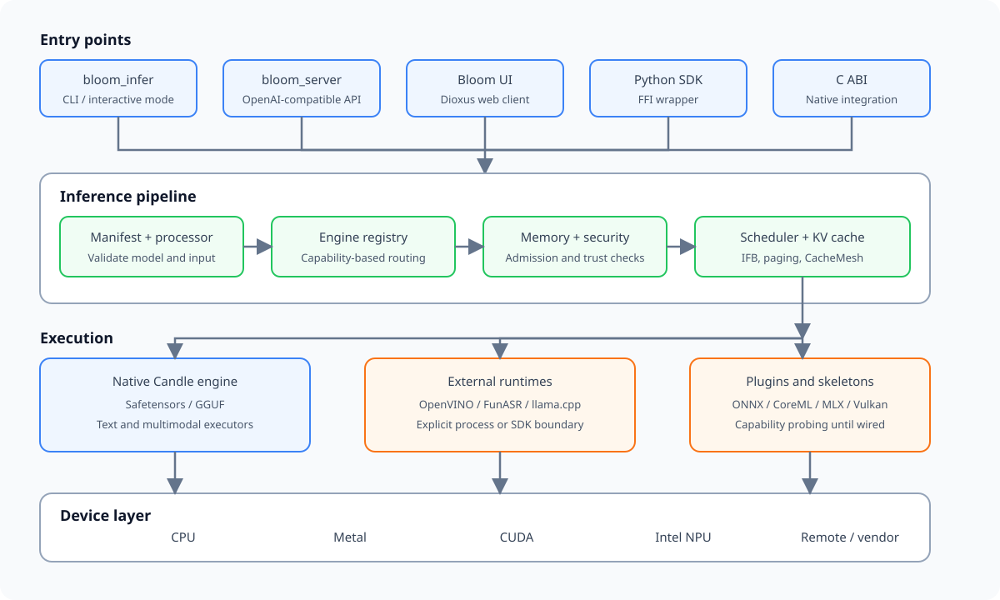

# Architecture

Bloom is a standalone inference engine. It owns model loading, preprocessing,
execution, in-engine scheduling, KV-cache management, and streaming output.
Cross-model orchestration belongs outside the engine.

## Request flow

1. A request enters through `bloom_infer`, `bloom_server`, the UI, or an SDK.
2. `InferencePipeline` loads or infers the model manifest and validates input.
3. `EngineRegistry` selects an engine from declared capabilities instead of
   trying implementations until one works.
4. Memory and security checks run before model execution.
5. The engine scheduler admits prefill and decode work, allocates KV-cache
   blocks, and applies the configured long-context policy.
6. The selected executor runs on a native backend or an explicit external
   runtime and returns typed output chunks.

## Workspace boundaries

| Crate | Responsibility |
| --- | --- |
| `bloomai-core` | Public data types, manifests, resource contracts, scheduling configuration, and errors |
| `bloomai-backend` | Device capabilities, hardware probing, reservation, and backend registry |
| `bloomai-engine` | Model loading, processors, executors, inference pipeline, scheduler, CLI, and HTTP server |
| `bloomai-tilelang` | Dynamic kernel compilation and loading |
| `bloomai-ffi` | Stable C ABI used by native and Python consumers |

Inside `bloomai-engine`:

| Module | Responsibility |
| --- | --- |
| `core` | Engine traits, routing, manifests, model I/O, memory planning, and pipeline assembly |
| `executor` | Candle models and adapters for external runtimes |
| `processor` | Text, image, audio, and multimodal preprocessing |
| `scheduler` | In-flight batching, preemption, paged KV cache, prefix reuse, and CacheMesh integration |
| `plugin` | Manifest validation and native, subprocess, WASM, or remote entry-point boundaries |
| `world` | Observation/action contracts for world-model workloads |

## Engine selection

Each engine publishes an `EngineCapability` containing supported model
families, formats, dtypes, devices, modalities, quantization modes, streaming
support, and maturity. Routing returns one of three results:

- `Native`: the engine directly supports the request.
- `Fallback(reason)`: execution is possible with a documented compromise.
- `Unsupported(reason)`: the engine cannot execute the request.

Skeleton adapters are discoverable for inspection and diagnostics but are not
eligible for normal auto-routing.

## Execution paths

- **Native:** Candle loads supported Safetensors and GGUF models in-process.
- **External runtime:** OpenVINO, FunASR, llama.cpp, and vendor tools cross an
  explicit process or SDK boundary.
- **Plugin:** third-party engines and backends declare capabilities through a
  manifest. Native plugins run as trusted in-process code.
- **Skeleton:** ONNX Runtime, CoreML, MLX, Vulkan, and similar adapters may only
  probe files and report missing runtime support until execution is connected.

The current maturity of each path is recorded in the
[support matrix](support-matrix.md).

## Scheduling boundary

Bloom schedules work within one loaded model instance: prefill, decode,
chunking, batching, KV allocation, and cache eviction. A higher-level runtime
or orchestrator may handle cross-model routing, device placement, residency,
and fleet-level policy.

See [scheduler.md](scheduler.md) for scheduling behavior and
[backend-adapters.md](backend-adapters.md) for adapter requirements.

## Extension rules

- Keep vendor SDKs and hardware toolchains out of the default build.
- Declare capabilities before loading a model.
- Return structured errors for missing files, hardware, features, and runtimes.
- Keep real-hardware tests behind explicit features or dedicated runners.
- Treat model packages, plugins, and external runners as supply-chain inputs.
